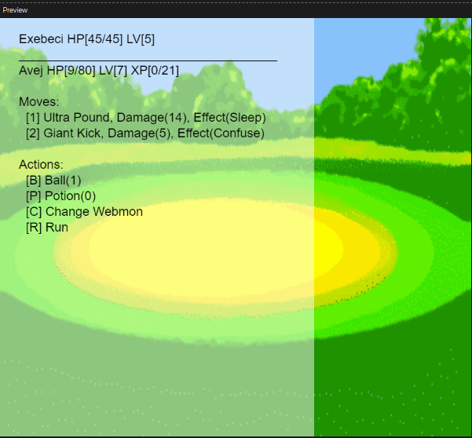
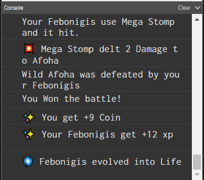
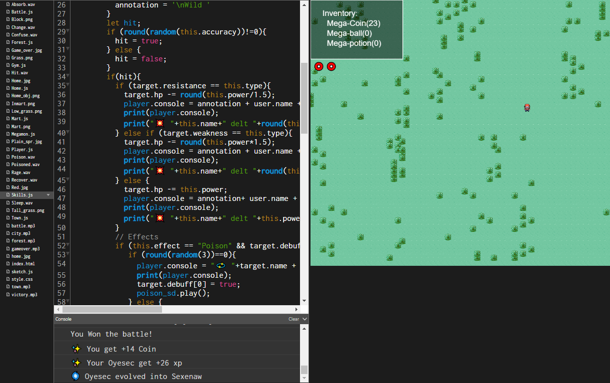

 

🎵 Megamon javascript monster, within your browser, Megamon generated creature, what an adventure, Megamon Megamophose, Megamon discover them all!

## What is Megamon?
An open source javascript P0k3m0n like inspired web game, that can be played on your internet browser.
> You are a young Megamon trainor from Mega-town city you travel around the Mega-town forest to discover new spiecies of Megamon and battle them to see if your are worthy to catch them with Megaball. When battling your Megamon will gain experience and eventually Megamorph into a new diferrent, more powerful Megamon with new abillitys. don't forget to go to the mega-shop to buy mega-potion to heal your megamon hp and healp the mrecover from cripling condition.

## How to play?
⚠️ To play you need to open the web console your __browser's developer console__. Their most of the game information will be displayed.
You can also use the default __dev console__ provided by the [p5js](https://p5js.org/download/support.html) editor.
> How to open the [browser's developer console](https://balsamiq.com/support/faqs/browserconsole/#:~:text=To%20open%20the%20developer%20console,(on%20Windows%2FLinux).)?

> To exit the starter town simply take the character past the edge of the game screen, by pressing the directional arrow key multiple times.

> To cheat (activate debug/dev mode) press the = key, if that make you happy, have fun.

> Feel free to edit the code as you like and even do a merge request (MR) if you want, i am open to suggestion and fix to improve this game.

### Links
---
 within p5.js online editor, [fullscreen](https://preview.p5js.org/DeathNotePad/present/utKTxnODO)(no editor) or
also on [Itch.io](https://amosnimos.itch.io/webmon)(no editor)
---

> Every __non free/open__ assets use in this project, are only temporary place older and will be replace as soon as possible, if you whant to contribute art, music, sounds to this project, please do so, I also need to replace every mention of the word P0kemon in the code and in the game to be replace with Codemon or somthing else i am not decided on the final game of this project. p5mon? jsmon? javamon? 

> open art i found that __could__ be used for this project
> https://opengameart.org/content/2d-rpg-characters
> https://www.deviantart.com/rubenartworks/art/Semilegendary-Fakemon-Gardion-399903833
> https://github.com/limbusdev/guardian_monsters_artwork
